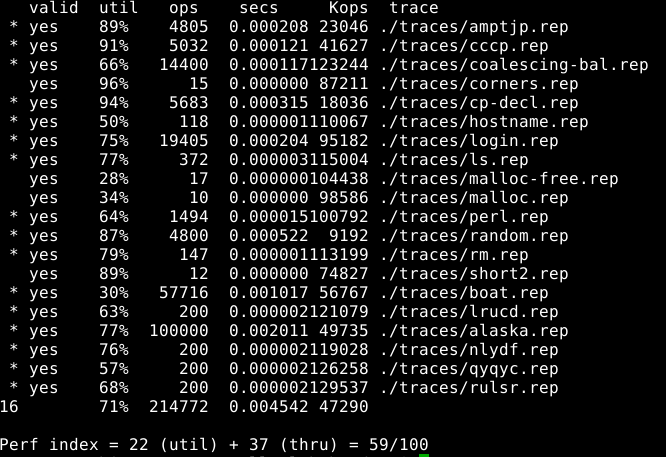
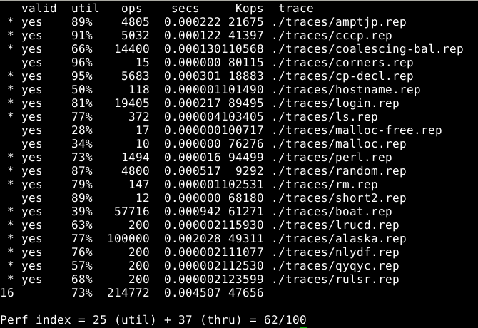
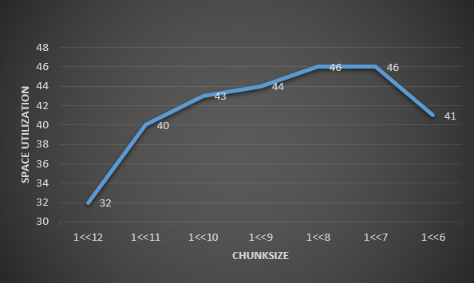
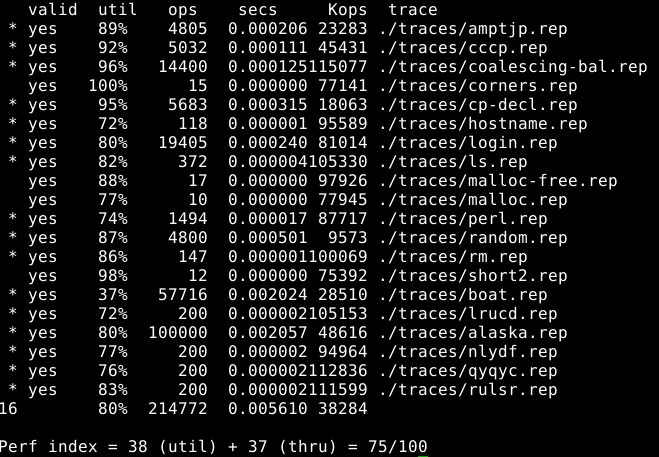
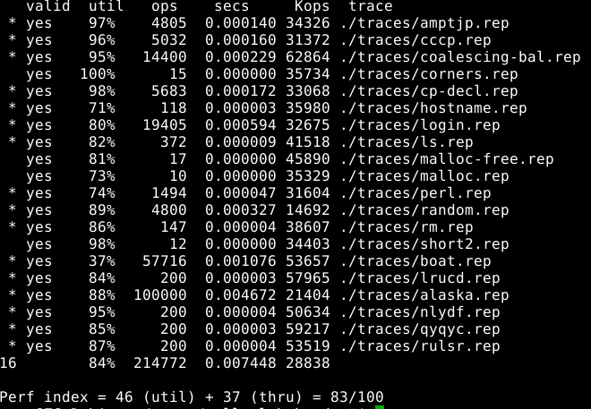
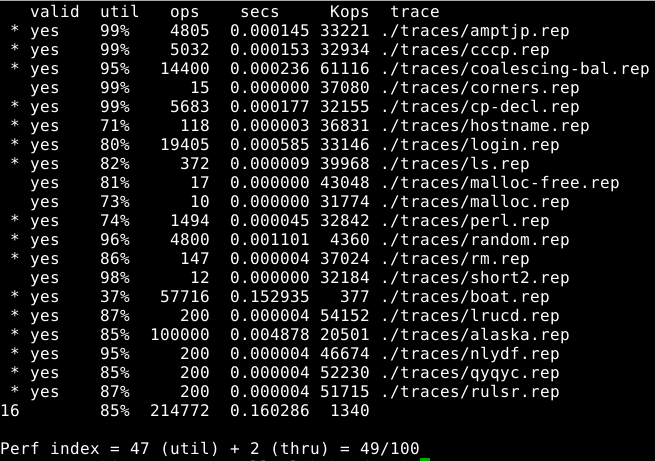
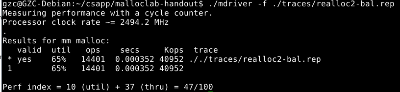
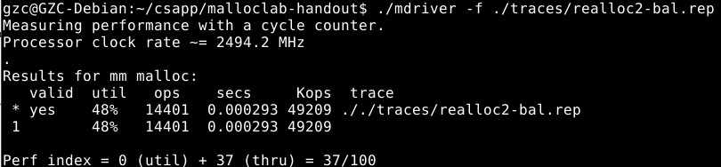

# Malloc Lab

1. implicit free list + first fit

   理解了如何利用`mm_checkheap`来debug，将`mm_checkheap`放置于可能出错的若干代码段前后，通过错误信息提示来判断出错的代码段。e. g. 如果代码段A前的`mm_checkheap`正确，而A后的`mm_checkheap`报错，则说明代码段A存在错误。

2. explicit free list + first fit

   * 调试中出现了cycles in the free list错误，采用hare and tortoise算法检测cycles in linked list。
   * 初始化函数`mm_init`，要将free list的起点`free_listp`赋值为`NULL`
   * `malloc(size)`中，size只需要加上header和footer的overhead即可，而不用再加上prev和next指针，因为allocated block不需要prev和next指针。这个一致性也使得implicit free list中实现的`header_to_paypload`和`payload_to_header`函数得以复用。

3. segregated free list + first fit 

4. improve realloc + first fit

   * 对`realloc`进行改进：

     * 如果new_size <= old_size，无需分配新的block和复制数据，只需重置old_block的大小为new_size（并将剩余空间free），返回相同地址

     * 如果new_size > old_size，先考虑将old_block和后面的block coalesce后大小可否满足，如可以，则无需分配新的block和复制数据，只需重置old_block的大小为new_size（并将剩余空间free），返回相同地址；

       否则，考虑将old_block和前后的block coalesce后大小可否满足，如可以，则**移动数据**，即**使用`memmove`而非`memcpy`**，因为`memcpy`内存地址不能overlap，而`memmove`可以。

     * 如果prev_size + old_size + next_size < new_size，则分配新的block并释放旧的block。

5. seglist + improved realloc + best fit

   * 每次`insert_block`按升序顺序插入，则首次找到的block即为best fit

## performance优化

1. 将mm-explicit-bad修改为mm-explicit时，即malloc(size)`的`asize`不加上prev和next指针的大小。测试后发现，每个allocated block节省16bytes并没有对space utilization有明显提高，所以之后我并没有采用 利用header的次低位来标识prev_block是否被分配，从而省去allocated block的footer的 优化手段。

   mm-explicit-bad 

   

   mm-explicit

   

   ​

2. 修改`CHUNKSIZE`可以提高空间利用率

   

   最佳`CHUNKSIZE`为1<<8

   mm-explicit最佳得分

   

   ​

3. mm-seglist

   size class以2^n为界划分

   

   修改size class的划分方式，performance没有明显提升（可能是没有好好尝试）

   ​

4. 采用seglist best fit对utilization提升有限，反而大大降低throughput

   

   而且针对realloc，best fit反而使utilization下降

   mm-realloc

   

   mm-realloc-bestfit

   

   ​

5. 遗憾

   realloc-bal.rep

   binary2-bal.rep

   的performance极极极差
